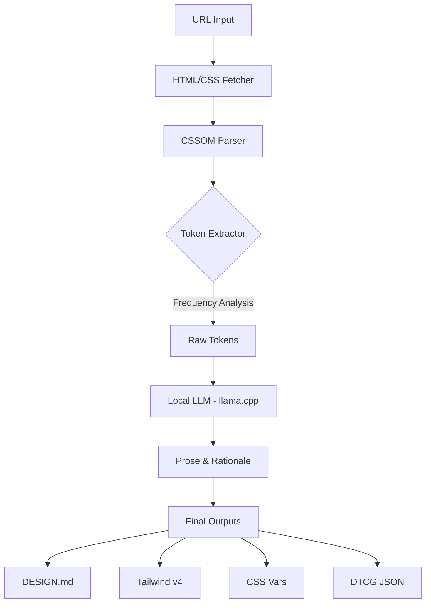

<p align="center">
  
</p>

# 🎨 DESIGNMD: The Ultimate Design Extractor

> **URLを入力するだけで、あらゆるウェブサイトから洗練されたデザインドキュメント（DESIGN.md）を自動生成。**  
> Simply enter a URL and instantly output a structured design system in Markdown.

[](https://choosealicense.com/licenses/mit/)
[](https://marketplace.visualstudio.com/)
[](https://github.com/ggerganov/llama.cpp)

---

## ✨ 究極の「URL to Design」体験 (Key Features)

DESIGNMDは、ウェブサイトのCSSOM（CSS Object Model）を直接解析し、AI（ローカルLLM）を活用して、実装に直結するデザインガイドラインを生成するVS Code拡張機能です。

- 🚀 **瞬時の抽出 (Instant Extraction)**: URLを入力するだけで、色、タイポグラフィ、スペーシング、コンポーネントを数秒で抽出。
- 🧠 **AIによる解説 (AI-Powered Insights)**: `llama.cpp`との連携により、デザインの哲学、Do's & Don'ts、コンポーネントの使い分けを自動生成。
- 📂 **4つの強力な出力フォーマット**:
  - `DESIGN.md`: AIエージェント（Cursor/Windsurf等）が即座に理解できる構造化ドキュメント。
  - `Tailwind v4`: 最新の `@theme` ブロック形式。
  - `CSS Variables`: `:root` カスタムプロパティ。
  - `DTCG JSON`: デザインツール（Figma等）で利用可能な標準フォーマット。

---

## 🛠 使い方 (How to Use)

1. **コマンドを実行**: `Ctrl+Shift+D` を押すか、コマンドパレットから `Design Extractor: Extract Design System from URL` を選択。
2. **URLを入力**: 抽出したいウェブサイトのURLを入力します。
3. **出力を確認**: 生成されたデザインシステムがウェブビューでプレビューされます。
4. **保存**: 必要なフォーマットを選んでダウンロード！

---

## 📝 生成例 (Real-world Example)

`https://note.com` から抽出された実際の `DESIGN.md` の抜粋です：

```markdown
## Overview
CSSOM周波数解析に基づくデザイントークン。

## Colors
- **Primary-1** (#08131a): ダークで重厚なメインカラー
- **Surface** (#ffffff): 清潔感のあるベースホワイト
- **Accent** (#1e7b65): インタラクティブ要素へのアクセント

## Typography
Helvetica Neueをベースとした、可読性の高いサンセリフ。

## Do's and Don'ts
✅ Do: ベースグリッドを使用して一貫した余白を維持する
✅ Do: 最も重要なアクションにのみアクセントカラーを使用する
❌ Don't: 1つのビュー内で異なる角丸（border-radius）を混ぜない
```

---

## 🚀 技術スタック (Architecture)



---

## 📥 セットアップ (Setup)

### 1. インストール
```bash
git clone https://github.com/msandroid/DESIGNMD.git
cd DESIGNMD
npm install
npm run compile
```

### 2. ローカルAIの連携 (推奨)
`llama.cpp`をバックエンドとして実行することで、より質の高い解説が生成されます。
```bash
./llama-server -m model.gguf --port 8000
```
デフォルトでは `http://localhost:8000` を参照します。

---

## 🛣 ロードマップ (Roadmap)

- [ ] **Headless Browser**: Playwrightによる完璧な計算済みスタイルの取得。
- [ ] **Figma Direct Export**: 直接Figmaファイルへ書き出し。
- [ ] **Design Diff**: 2つのサイトのデザイン差分を視覚化。

---

## 🤝 サポート & コントリビュート

このプロジェクトが気に入ったら、ぜひスターをお願いします！また、[Ko-fi](https://ko-fi.com/aoi_android)でのサポートも歓迎しています。

---

**Built with ❤️ for AI-native developers.**  
*Made for AI agents like Cursor, Windsurf, and Claude Code.*
