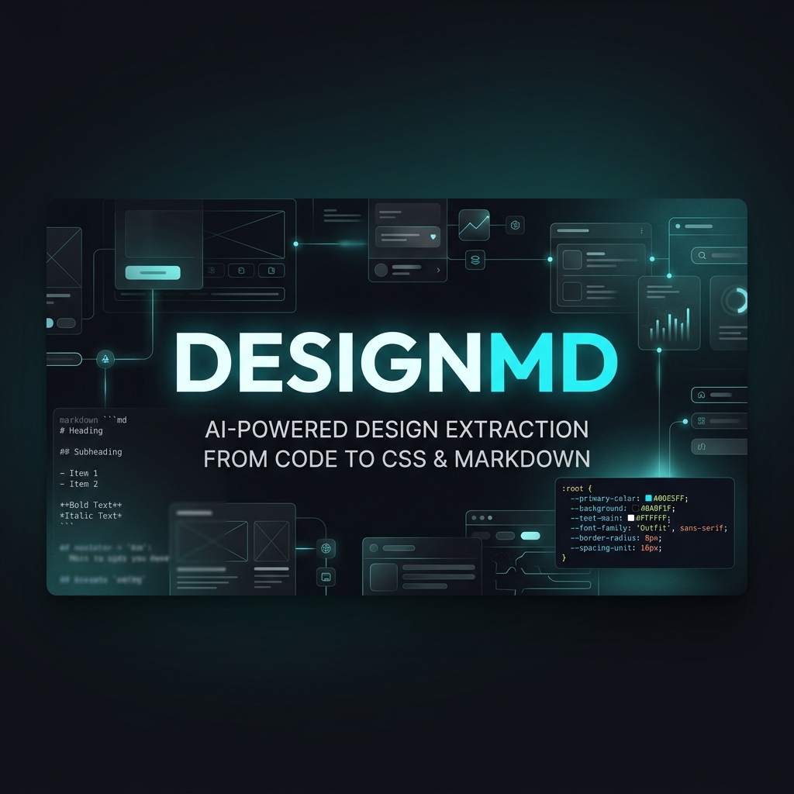
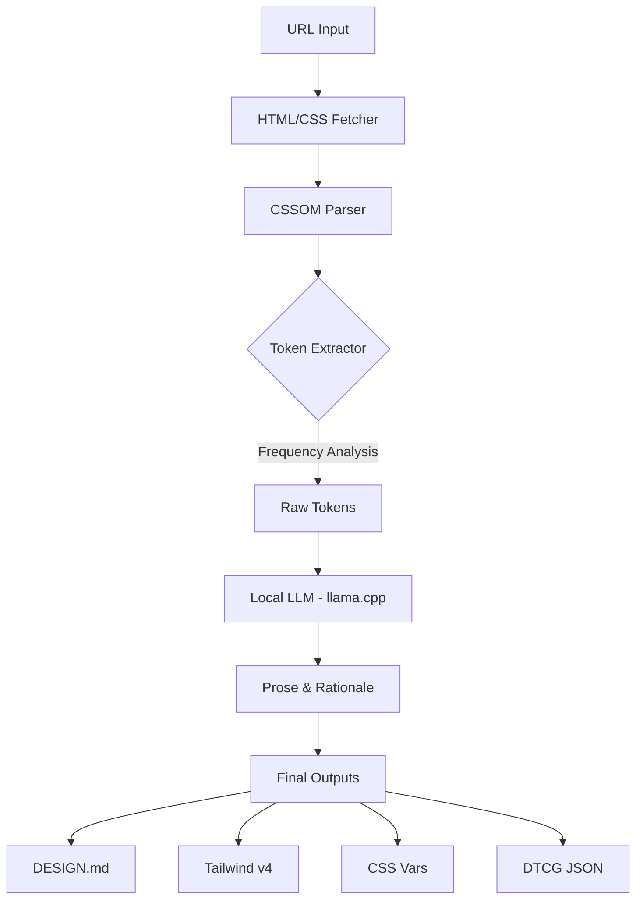

<p align="center">
  
</p>

# 🎨 DESIGNMD: The Ultimate Design Extractor

> **Transform any website into a structured design system (DESIGN.md) instantly by just entering a URL.**

[](https://choosealicense.com/licenses/mit/)
[](https://marketplace.visualstudio.com/)
[](https://github.com/ggerganov/llama.cpp)

---

## ✨ The "URL to Design" Experience

DESIGNMD is a VS Code extension that directly analyzes a website's CSSOM (CSS Object Model) and leverages local LLMs (via llama.cpp) to generate comprehensive design guidelines ready for implementation.

- 🚀 **Instant Extraction**: Extract colors, typography, spacing, and components from any URL in seconds.
- 🧠 **AI-Powered Insights**: Uses `llama.cpp` to automatically generate design philosophy, Do's & Don'ts, and component usage guidance.
- 📂 **Multi-Format Export**:
  - `DESIGN.md`: Structured documentation optimized for AI agents (Cursor, Windsurf, etc.).
  - `Tailwind v4`: Modern `@theme` block format for seamless integration.
  - `CSS Variables`: Ready-to-use `:root` custom properties.
  - `DTCG JSON`: Standard format for design tools like Figma.

---

## 🛠 How to Use

1. **Launch Command**: Press `Ctrl+Shift+D` or select `Design Extractor: Extract Design System from URL` from the Command Palette.
2. **Enter URL**: Provide the website URL you wish to analyze.
3. **Preview**: Review the extracted design system in the interactive Webview panel.
4. **Save**: Download your preferred format and drop it into your project.

---

## 📝 Generation Example

A snippet from a real `DESIGN.md` extracted from `https://note.com`:

```markdown
## Overview
Design tokens extracted via CSSOM frequency analysis.

## Colors
- **Primary-1** (#08131a): Deep, professional main color
- **Surface** (#ffffff): Clean base white
- **Accent** (#1e7b65): Vibrant accent for interactive elements

## Typography
Clean sans-serif based on Helvetica Neue for high readability.

## Do's and Don'ts
✅ Do: Maintain consistent white space using the base grid.
✅ Do: Use the accent color only for the primary call-to-action.
❌ Don't: Mix different border-radii within a single view.
```

---

## 🚀 Technical Architecture



---

## 📥 Setup

### 1. Installation
```bash
git clone https://github.com/msandroid/DESIGNMD.git
cd DESIGNMD
npm install
npm run compile
```

### 2. Local AI Integration (Recommended)
Run `llama.cpp` as a backend to enable high-quality prose generation.
```bash
./llama-server -m model.gguf --port 8000
```
By default, the extension connects to `http://localhost:8000`.

---

## 🛣 Roadmap

- [ ] **Headless Browser**: Use Playwright for perfect computed style extraction.
- [ ] **Figma Direct Export**: Direct upload to Figma files.
- [ ] **Design Diff**: Visual comparison of design changes between two versions.

---

## 🤝 Support & Contribution

If you find this project helpful, please give us a star! You can also support the developer on [Ko-fi](https://ko-fi.com/aoi_android).

---

**Built with ❤️ for AI-native developers.**  
*Optimized for AI agents like Cursor, Windsurf, and Claude Code.*
